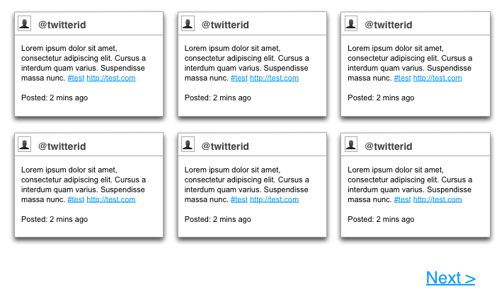

# JavaScript // Mid Weight Developer // Test 2 #

### Test Overview ###

Use the provided JSON file (mock.json) to build a 
grid of tweets as per the provided "wireframe.png":

This a technical test, so although aesthetically 
pleasing responses are welcomed, the HTML, CSS & JavaScript quality will be tested, 
not the visuals.

The tweets should be loaded asynchronously and processed into HTML elements and 
injected into the DOM dynamically, using either flat JavaScript or JQuery.

Each tweet should minimally show the following information:

* Clickable Twitter Profile Image (clicking through to user's feed)
* Clickable Twitter Profile Name (clicking through to user's feed)
* The Tweet (with Clickable Hash Tags & Urls)
* The date of the tweet in normal Twitter format.

I you would like to use a JQuery, you may use JQuery from Google's CDN 
[https://developers.google.com/speed/libraries/devguide#jquery](https://developers.google.com/speed/libraries/devguide#jquery)

### Bonus Points ###

* "Loading Screen"
* Use of the twitter API [http://dev.twitter.com/](http://dev.twitter.com/) instead of the mock json file
* Human dates, i.e 2 minutes ago, 2 hours ago, 10 days ago
* Nice animations and tweens
* Detecting image links, making the tweets 'background' the dynamic image.
* Pagination using Twitter Pages, with a Page x of x indicator.
* Lazy loading more tweets using Twitter's pagination library
* Fault tolerance and messaging around twitter empty fields.
* Adaptive CSS, i.e: dropping 2 columns on tablets and 1 on mobile.

### Expected Response ###

You should provide 3 source files, index.html, site.js & site.css, as as a README.md file outlining your approach.